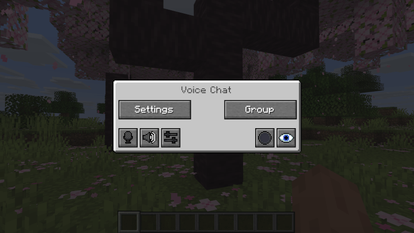
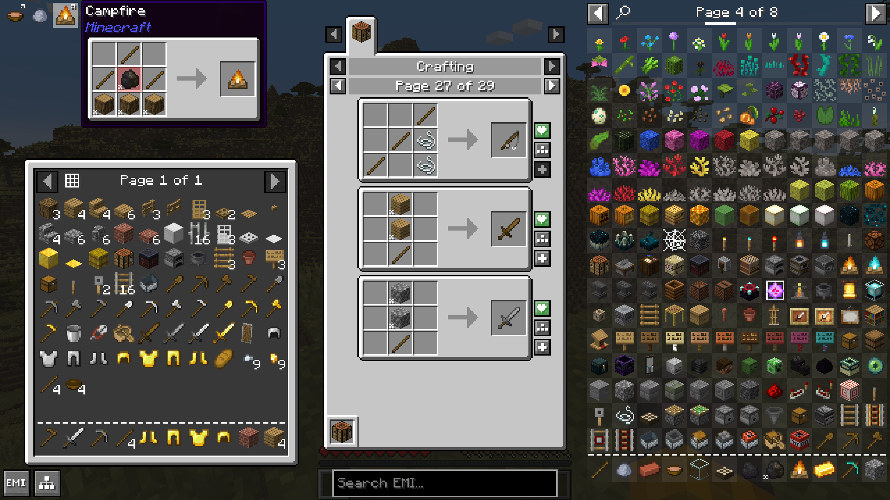
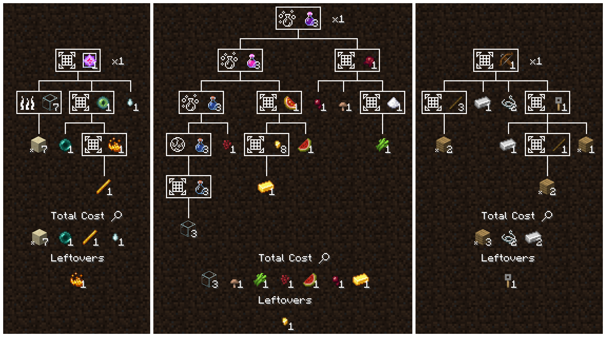

# 주요 모드 가이드 (Featured Mods)

> 이 페이지는 서버에서 **알아두면 플레이가 편해지는 핵심 모드들**을 간단히 설명합니다. 자세한 모드 목록은 홈의 **Mod list — one-liners**를 참고하세요.

## 0) 음성 채팅 & 한국어 채팅  
{ width="720" }  
- **인게임 음성 채팅**: 거리감이 적용되는 proximity 보이스. `V`키 또는 초기 설정 창에서 세부 설정 가능.  
- **한국어 채팅 개선**: IME 입력 문제를 개선해 한글 채팅이 더욱 쾌적합니다.  

## 1) 레시피/정보 — JEI, EMI  
| { width="50%" } | { width="50%" } |
|:--:|:--:|
{ width="360" }
{ width="360" }
- 조합법/몹 드랍/주민 교환 등 **아이템 획득 경로**를 한눈에 보여줍니다.  
- 인벤토리 우측(또는 좌측)에 거대한 아이템 목록과 검색창이 표시됩니다.  

## 2) 지도 — Antique Atlas

- (기본 `M`키) **다녀온 곳이 자동으로 기록되는 종이 지도**를 추가합니다. 마커로 표시/메모 가능.
- 빈 책 이름을 모루에서 *Antique Atlas*로 바꾸면 **손에 들고 다니는 미니맵**으로 변환됩니다.
- 미니맵/월드맵보다 **몰입감**이 좋습니다.

## 3) 농사/요리 — Farmer’s Delight (+ 애드온)
- 수많은 **작물과 요리 레시피**, 비옥한 땅 등 **농사 시스템 확장**.
- 대형 작물, 양조(술), 다양한 차, 과일 나무, 도마/냄비/프라이팬 조리 등.
- 함께 쓰면 좋은 애드온(차/과일/해산물/문화권 요리 등)이 다수 포함됩니다.

## 4) 운반 — Carry On
- **Shift + 우클릭**으로 상자/몹/일부 블록을 들어서 옮길 수 있습니다.

## 5) 손수 건네기 — Hand Over Your Items
- **우클릭**으로 손에 든 아이템을 **다른 플레이어에게 직접 전달**합니다.

## 6) 자동화 — Create
- 수력/풍력/화력으로 구동되는 **톱니바퀴/컨베이어/기계 장치**로 제작과 **자동화**를 구현합니다.

## 7) 비행 수단 — Immersive Aircraft
- 바닐라+ 스타일의 **복엽기, 수상기, 쿼드콥터, 화물선/전함형 항공기** 등 다양한 항공 장비.
- **커스텀 부품**으로 성능 개조 가능.

## 8) 기계 — Immersive Machinery
- 바닐라+ 감성의 **잠수함/드릴카/대나무 드론** 등 각종 **기능형 기계**를 추가합니다.

## 9) 연주 — Immersive Melodies
- **연주 가능한 악기**를 추가합니다. 1인/합주 RP에 좋아요.

## 10) 악세서리 (더블 점프/낙하 면역 등)
- 손/허리/신발 등 **여러 장신구 슬롯(H키)** 에 장착해 **점프/낙하/이동/유틸** 효과를 얻습니다.

## 11) 건축 블록 모음
- **창문/울타리 대각 연결**, **다리/지붕/가구** 등 **건축 특화 블록** 대거 추가.

## 12) 동물 추가 (예시)
- **수달**: 조개를 깨서 5% 확률로 **진주** 획득 → 엔더 진주/목걸이 제작.
- **패럿(앵무)**: 생 토끼 고기로 길들이고, 주기적으로 **땅을 파 보물**을 찾습니다.
- **비단잉어**: 주변 플레이어에게 **행운** 효과.
- **덤보문어**: 깊은 바다, **산소 방울**로 익사 위기 플레이어를 구해줌.
- **바다토끼(바다 달팽이)**: 점액 → **슬라임 블록** 제작.
- **잠자리**: 거미 눈알로 길들이고 **전투 보조**, **갑옷** 장착 가능.
- **나뭇잎 벌레**: 음악에 **댄스**!
- **레서판다**: 대나무로 번식, 달콤한 열매로 길들이고 **적대적 몹을 쫓음**.
- **흰머리오목눈이**: 밀 씨앗으로 길들이는 귀여운 새.
- **깡충거미**: 동료 전투 + **거미 비단** 드랍 → **그래플링 훅/끈** 제작, 주변 고치에서 보상.

## 13) 구조물 추가 & 리파인
- 월드 전역에 **던전/탑/건물**이 대량으로 추가됩니다.
- 기존 구조물도 더 커지고 **보상이 다양**해집니다.

## 14) 주민 확장
- **새로운 직업/거래**가 대거 추가되어 **경제 플레이**가 풍성해집니다.

## 15) 애니메이션 강화
- 다양한 **모션/제스처**로 생동감 있는 화면 연출.

## 16) 사운드 강화
- **환경음/발자국/리버브** 등 사운드 경험을 업그레이드합니다.

## 17) 미션 보드
- 마을에 **퀘스트 게시판**이 랜덤 생성되어 **자잘한 임무**로 돈을 벌 수 있습니다.

## 18) 보스 & 신규 몹
- **강력한 보상**을 주는 보스와 다양한 신규 몹이 추가됩니다.

## 19) 가방(인벤 확장)
- **여분 인벤토리**를 제공하는 가방 아이템이 추가됩니다.

---

*이 가이드는 운영자 메모를 바탕으로 작성되었습니다. 시즌별 정책/구성에 따라 일부 내용은 달라질 수 있습니다.*
